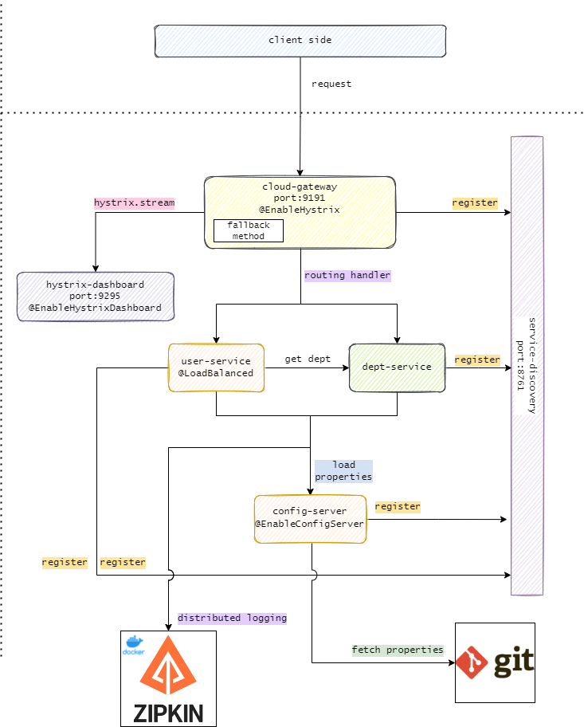

# [Learn to build RESTful Microservices with Spring Boot and Spring Cloud](https://www.udemy.com/course/spring-boot-microservices-and-spring-cloud/)



## Stacks used

- Java 11
- Spring boot
- Docker
- MySql docker container
- Postman

## Run DB server first!

      docker run --detach --env MYSQL_ROOT_PASSWORD=root --env MYSQL_DATABASE=mydb --env MYSQL_PASSWORD=root --env MYSQL_USER=admin --name localhost --publish 3306:3306 mysql:8.0

<details>
<summary>Debugging your DB server</summary><br>

Run mysql in cli using docker

```
docker exec -it localhost bash
```

Connect to mysql

```
mysql -u admin -proot;
```

Test

```
use mydb;
show tables;
desc users;
select * from users;
```

Stop & remove all running proceses

```
docker rm $(docker ps -a -q) -f
```

</details>

## Use case

user-service will call dept-service

## service registry

Eureka Server is an application that holds the information about all client-service applications. Every Micro service
will register into the Eureka server and Eureka server knows all the client applications running on each port and IP
address. Eureka Server is also known as Discovery Server.

one of the benefits is you can call the service name INTERNALLY instead of the hostname:port number.

## API gateway

A programming that sits in front of an API ( Application Programming Interface) and is the single-entry point for
defined back-end APIs and microservices. Primarily responsible for request routing, the gateway intercepts all requests
from clients. It then routes the requests to the appropriate microservice.

`Routing Handler`

Being focused on routing requests, it forwards requests to a Gateway Handler Mapping, which determines what should be
done with requests matching a specific route. With configs in place the url will be slightly changed:

from calling the ms directly,

    http://localhost:9001/departments/

to calling the api-gateway

    http://localhost:9191/departments/

Without this config you can still use the gateway like this:

    http://localhost:9191/department-service/departments/

`Circuit breaker`

API gateway can serve as circuit breaker which identifies which services are not running and implements a fallback
method available which informs the user as the response.

stop any service and run any request to see the fallback response.

## Multiple instances

how to run multiple instance?

1. Duplicate run configurations and run it
2. use command line:

   mvn spring-boot:run -Dspring-boot.run.arguments="--spring.application.instance_id=shah45 --server.port=1234"

We can now start multiple instances but the prob is service registry will register only one as the port assigned is
fixed in property file. we can ask Spring to assign static port number by assigning server.port=0

If you run multiple instances using Spring, service registry will still show one instance id running as the port number
we assigned was fixed i.e 0. this wont be the case if we start instances using mvn command as we manually assign a port
and instance value. to solve this, we create a property name eureka.instance.instance-id with our own randomly generated
value. Now try to run another instance again using Spring and you can see multiple instance registering in Eureka.


## Load Balancing

Load balancing is the process of distributing traffic among different instances of the same application. API gateway has
a built in load balancer so we can use it right away.

To test for this, simply run multiple instances of user / dept service and check the status through the endpoint
status/check. this endpoint shows the port number and everytime we run this, it will show diff port number indicating
that requests are being distributed across different instances.


## Hystrix dashboard

A nice optional feature of Hystrix is the ability to monitor its status on a dashboard.

A new service will be created with `spring-cloud-starter-hystrix-dashboard` and `spring-boot-starter-actuator` in the
pom.xml. Once done, we will run: `http://localhost:9295/hystrix` to view the dashboard:


To allow the dashboard to monitor, we need to give hystrix streams (in the form of url) in the field of the dashboard.
the url is `localhost:9191/actuator/hystrix.stream` which is from the api-gateway service (which we have added
additional config). run this url to ensure there is a stream coming.


Once done, paste this url in hystrix dashboard:


Re-run all the requests from user-service and dept-service and view the dashboard. you will get something like this:


